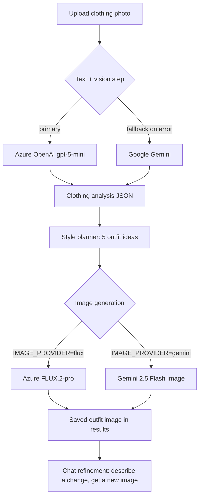

# AI Fashion Stylist

Upload one clothing photo and let AI do the rest: it analyzes the garment, plans five complete outfits around it, and generates photorealistic full-body images of you wearing each look.

Built with **Django 5.2** on the backend, **Azure OpenAI (gpt-5-mini)** as the primary vision/text engine with **Google Gemini** as automatic fallback, and **Azure AI Foundry FLUX.2-pro** (or Gemini 2.5 Flash Image, a.k.a. "Nano Banana") for image editing.

> The tagline on the landing page says it best: *"Your Style. Reimagined."*

---

## Table of Contents

- [How It Works](#how-it-works)
- [Features](#features)
- [AI Provider Architecture](#ai-provider-architecture)
- [Tech Stack](#tech-stack)
- [Getting Started](#getting-started)
  - [Prerequisites](#prerequisites)
  - [Installation](#installation)
  - [Environment Variables](#environment-variables)
  - [Getting API Keys](#getting-api-keys)
- [Using the App](#using-the-app)
- [REST API](#rest-api)
- [URL Reference](#url-reference)
- [Data Models](#data-models)
- [Django Admin](#django-admin)
- [Running the Tests](#running-the-tests)
- [Project Structure](#project-structure)
- [Engineering Notes](#engineering-notes)
- [Known Limitations](#known-limitations)
- [Troubleshooting](#troubleshooting)
- [Contributing](#contributing)

---

## How It Works



The whole flow is synchronous and needs no JavaScript framework: you upload a photo, the app immediately runs the analysis and the style plan, and you land on a results page where each of the five planned outfits can be turned into a generated image with one click. From there, a chat-style refinement page lets you request changes in plain language ("make it more formal", "swap the sneakers for boots") and the app produces a new image that keeps your original garment intact.

Everything is stored in SQLite and keyed by UUID, so any result page can be revisited by its link, and every generated image along with the prompt that produced it is persisted for review in the Django admin.

## Features

All of the following are implemented in the code — nothing on this list is aspirational.

- **Clothing photo upload** — JPG / JPEG / PNG / WEBP, validated to 10 MB max (`stylist/forms.py`).
- **AI garment analysis** — returns structured JSON: category, subcategory, primary/secondary color, pattern, fit, neckline, sleeve length, material, style, seasons, gender, and a confidence score (`stylist/services/prompts.py`).
- **Five-outfit style plan** — an LLM "celebrity stylist" prompt produces five distinct outfit ideas, each with theme, bottom, footwear, accessories, bag, jewelry, and a written rationale.
- **Outfit image generation** — edits the uploaded photo into a full-body editorial shot of the planned outfit, keeping the hero garment's color, print, logo, and shape unchanged.
- **Provider routing** — switch image providers with a single env var (`IMAGE_PROVIDER=flux` or `gemini`).
- **Automatic text fallback** — if Azure OpenAI fails for any reason, the same analysis/planning step transparently retries with Gemini (`stylist/services/workflow.py`).
- **Chat refinement** — natural-language follow-ups ("Refine Your Outfit" page) that generate a fresh image per request and keep every version.
- **"Surprise me" and custom prompts** — one-click random outfit generation or your own free-text styling instruction on the results page.
- **REST image-editing endpoint** — `POST /api/v1/images/edit`, a standalone FLUX.2-pro proxy with MIME/size validation and clean JSON errors.
- **Django admin dashboards** — browse uploads, analyses, style sessions, and generated images with search and filters (`stylist/admin.py`).
- **Editorial UI** — Tailwind CSS (CDN) with an Inter + Playfair Display cream/beige fashion-editorial look, defined inline in the templates.

## AI Provider Architecture

| Pipeline step | Primary | Fallback | Where |
|---|---|---|---|
| Clothing analysis (vision) | Azure OpenAI `gpt-5-mini` | Google Gemini (`gemini-2.5-flash` chain) | `workflow.run_analysis` |
| Style planning (text) | Azure OpenAI `gpt-5-mini` | Google Gemini | `workflow.run_style_plan` |
| Plan refinement (text) | Azure OpenAI `gpt-5-mini` | Google Gemini | `workflow.run_refined_plan` |
| Outfit image generation | `IMAGE_PROVIDER` provider — Azure **FLUX.2-pro** or **Gemini 2.5 Flash Image** | none (single provider by design) | `ImageRouter` |
| Standalone image edit API | Azure FLUX.2-pro | none | `api_views.edit_image_api` |

Text steps try Azure first and fall back to Gemini on any exception, logging a warning with both errors if both fail. Image generation is intentionally routed to exactly one provider (the one named in `IMAGE_PROVIDER`) — unknown values fall back to `GeminiService`.

**Gemini model chains** (first that works wins, overridable via env):

- Text: `gemini-2.5-flash`, `gemini-3-flash-preview`, `gemini-2.0-flash`, `gemini-flash-latest`
- Image: `gemini-2.5-flash-image` (Nano Banana), `gemini-3.1-flash-lite-image`, `gemini-2.5-flash-image-preview`

Both chains retry on 429/503 with linear backoff (`MAX_RETRIES = 3` per model) before moving to the next model in the list.

## Tech Stack

| Layer | Technology |
|---|---|
| Backend | Django 5.2.7 (project package: `config`, single app: `stylist`) |
| Database | SQLite 3 (`db.sqlite3`, gitignored) |
| AI — text/vision | Azure OpenAI `gpt-5-mini` via the official `openai` SDK (v1 endpoint), Google Gemini via `google-genai` |
| AI — image editing | Azure AI Foundry FLUX.2-pro (Black Forest Labs, REST) and/or Gemini 2.5 Flash Image |
| Image handling | Pillow (Django `ImageField`) |
| Config | python-dotenv (`.env` at repo root) |
| HTTP client | requests |
| Frontend | Server-rendered Django templates + Tailwind CSS CDN + Google Fonts (Inter, Playfair Display) |

> Note on `requirements.txt`: it is a raw pip freeze that contains duplicated pins and several packages the app never imports (e.g. `boto3`, `groq`, `replicate`, `huggingface_hub`). The packages actually used at runtime are: `Django`, `python-dotenv`, `Pillow`, `google-genai`, `openai`, and `requests`.

## Getting Started

### Prerequisites

- **Python 3.10+** (Django 5.2 requires 3.10 or newer)
- pip
- Git

### Installation

```bash
# 1. Clone
git clone https://github.com/JethvaBhavansi/Fashionstylist.git
cd Fashionstylist

# 2. Create and activate a virtual environment
python -m venv venv
source venv/bin/activate          # Linux / macOS
# venv\Scripts\activate           # Windows

# 3. Install dependencies
pip install -r requirements.txt

# 4. Create your .env from the template (see next section)
cp .env.example .env

# 5. Apply migrations (creates db.sqlite3)
python manage.py migrate

# 6. Optional: create an admin user for /admin/
python manage.py createsuperuser

# 7. Run
python manage.py runserver
```

Open http://127.0.0.1:8000/ — with `DEBUG=True` and `ALLOWED_HOSTS = []`, Django automatically permits `localhost` / `127.0.0.1`.

Upload directories (`media/uploads/`, `media/generated/`) are created automatically by Django when the first image is saved; both are gitignored.

### Environment Variables

Copy `.env.example` to `.env` and fill in real values. This table reflects **exactly what the code reads** — nothing else is required.

| Variable | Required? | Default | Read by | Purpose |
|---|---|---|---|---|
| `SECRET_KEY` | Yes in production | insecure dev fallback in `settings.py` | Django core | Django secret key |
| `DEBUG` | No | `False` | Django core | Dev only — see [Known Limitations](#known-limitations) for a string-truthiness quirk |
| `IMAGE_PROVIDER` | Yes | `gemini` (router default) | `ImageRouter` | `flux` (Azure FLUX.2-pro) or `gemini` (Nano Banana) |
| `GOOGLE_API_KEY` | Yes* | — | `GeminiService` | Gemini API key from Google AI Studio |
| `GEMINI_TEXT_MODELS` | No | built-in chain | `gemini.py` | Comma-separated text model override |
| `GEMINI_IMAGE_MODELS` | No | built-in chain | `gemini.py` | Comma-separated image model override |
| `AZURE_OPENAI_ENDPOINT` | Yes* | — | `azure_openai.py` | Azure resource endpoint (placeholder values are rejected at startup) |
| `AZURE_OPENAI_API_KEY` | Yes* | — | `azure_openai.py` | Azure OpenAI key ("Key 1" / "Key 2") |
| `AZURE_OPENAI_MODEL` | No | `gpt-5-mini` | `azure_openai.py` | Deployment name |
| `AZURE_USE_RESPONSES_API` | No | `0` | `azure_openai.py` | `1` to use the Responses API instead of Chat Completions |
| `AZURE_FLUX_ENDPOINT` | If `IMAGE_PROVIDER=flux` | — | `settings.py` / `flux.py` | AI Foundry provider URL |
| `AZURE_FLUX_API_KEY` | If `IMAGE_PROVIDER=flux` | — | `settings.py` / `flux.py` | Bearer token |
| `AZURE_FLUX_MODEL` | No | `FLUX.2-pro` | `settings.py` | Model id |
| `AZURE_FLUX_API_VERSION` | No | `preview` | `settings.py` | Azure api-version |

\* You need **either** Azure OpenAI **or** a `GOOGLE_API_KEY` for the text steps to succeed; the image steps need whichever provider `IMAGE_PROVIDER` points to.

> `AI_PROVIDER_ORDER` appears in `.env.example` but is **not** read by the current code — the Azure-first, Gemini-fallback order is hardcoded in `workflow.py`.

### Getting API Keys

**1. Google Gemini** (text fallback + optional image provider)

1. Go to [Google AI Studio](https://aistudio.google.com/) (or Google Cloud Console → enable *Generative Language API*).
2. Create an API key.
3. Put it in `.env` as `GOOGLE_API_KEY=...`

**2. Azure OpenAI — gpt-5-mini** (primary analysis + planning)

1. In the [Azure Portal](https://portal.azure.com/), create an **Azure OpenAI** resource (the `.env.example` notes a Korea Central deployment).
2. Deploy `gpt-5-mini` from the Azure OpenAI Studio *Deployments* page; note the deployment name.
3. Copy the endpoint from *Keys and Endpoint* — a bare resource host like `https://<resource>.openai.azure.com` is enough; the code normalizes it to the `/openai/v1/` base URL and refuses obvious placeholders like `your-resource`.
4. Set `AZURE_OPENAI_ENDPOINT`, `AZURE_OPENAI_API_KEY`, and (if your deployment name differs) `AZURE_OPENAI_MODEL`.

**3. Azure AI Foundry — FLUX.2-pro** (image generation)

1. In [Azure AI Foundry](https://ai.azure.com/), get access to the Black Forest Labs `FLUX.2-pro` model.
2. Copy the provider endpoint (looks like `https://<resource>.services.ai.azure.com/providers/blackforestlabs/v1/FLUX.2-pro`) and its key.
3. Set `AZURE_FLUX_ENDPOINT`, `AZURE_FLUX_API_KEY` and set `IMAGE_PROVIDER=flux`.

The service accepts either a full provider URL or a bare endpoint — it appends `/providers/blackforestlabs/v1/<model>` itself when `/providers/` is not already present in the URL.

## Using the App

1. **Home** (`/`) — landing page with a *Get Started* button.
2. **Upload** (`/upload/`) — pick a clothing photo (JPG/JPEG/PNG/WEBP, up to 10 MB) and submit. The form rejects other extensions and oversized files with a validation error.
3. **Analysis** — after upload you are redirected to `/analysis/<uuid>/`, which (on first visit) runs the vision analysis and the five-outfit style plan, stores both, then redirects to the results. This is the slow step — two LLM calls happen here, so give it a few seconds.
4. **Results** (`/results/<uuid>/`) — shows the detected garment details, the five-outfit plan, and a gallery of generated images. For each outfit you can:
   - **Generate** — render that specific outfit (`outfit_index` POST);
   - **Custom prompt** — describe any change you want;
   - **Surprise me** — a random, wildly creative outfit.
5. **Chat refinement** (`/chat/<uuid>/`) — type a change in plain English, submit, and a newly generated image is saved to the session and shown alongside your original upload.
6. Every generated image is stored under `media/generated/` with the prompt that created it, and appears in the admin.

## REST API

Besides the web UI, the project exposes a standalone image-editing endpoint backed by Azure FLUX.2-pro. It is CSRF-exempt by design so it can be called from scripts and external clients.

### `POST /api/v1/images/edit`

`multipart/form-data`

| Field | Type | Required | Notes |
|---|---|---|---|
| `image` | file | yes | `image/jpeg`, `image/png`, or `image/webp`; max 10 MB |
| `prompt` | string | yes | What to change |
| `width` | int | no | Default `1024` |
| `height` | int | no | Default `1024` |
| `output_format` | string | no | `jpeg` (default), `png`, or `webp` |

**Example**

```bash
curl -X POST "http://localhost:8000/api/v1/images/edit" \
  -F "image=@reference.jpg" \
  -F "prompt=Change the shirt to a premium black formal jacket while keeping the face, pose and background unchanged."
```

**Success — 200**

```json
{
  "success": true,
  "image_url": "http://localhost:8000/media/generated/flux_<uuid>.jpeg",
  "model": "FLUX.2-pro"
}
```

If Azure returns a hosted URL, it is passed through; if it returns base64, the bytes are decoded and saved under `media/generated/` and a local URL is returned.

**Errors**

| Status | Meaning |
|---|---|
| 400 | Missing image/prompt, unsupported format, > 10 MB, invalid dimensions, invalid image data |
| 405 | Method not allowed (use POST) |
| 429 | Azure rate limit hit |
| 500 | Service misconfigured (missing/invalid Azure credentials) |
| 502 | Azure upstream error or unrecognized response shape |

## URL Reference

| URL | Methods | View |
|---|---|---|
| `/` | GET | Landing page |
| `/upload/` | GET, POST | Upload form |
| `/analysis/<uuid>/` | GET | Runs analysis + style plan, redirects to results |
| `/results/<uuid>/` | GET | Outfit plan + image gallery |
| `/chat/<uuid>/` | GET, POST | Chat-based refinement |
| `/generate-image/<uuid>/` | POST | Generates one image (`outfit_index`, `custom_prompt`, or `random_style`) |
| `/api/v1/images/edit` | POST | REST image-edit endpoint |
| `/admin/` | — | Django admin |

## Data Models

Defined in `stylist/models.py`; all inherit a timestamped abstract base with a UUID and `created_at` / `updated_at`.

```
Upload                      # the original clothing photo (media/uploads/)
 └── ClothingAnalysis       # OneToOne — category, dominant color, full analysis JSON
      └── StyleSession      # FK — theme, user prompt, full recommendation JSON
           └── GeneratedImage  # FK — image file, option number, generation prompt
```

- `Upload.original_image` — `ImageField` → `uploads/`
- `ClothingAnalysis.analysis_json` — the raw AI analysis (colors, fit, material, confidence, ...)
- `StyleSession.recommendation_json` — the five planned outfits
- `GeneratedImage.generated_image` — `ImageField` → `generated/`, plus `option_number` and the exact `generation_prompt` used

Cascade deletes flow downwards: removing an upload removes its analysis, sessions, and images.

## Django Admin

All four models are registered with sensible list displays, search, ordering, and read-only fields (`stylist/admin.py`):

- **Uploads** — searchable by UUID, newest first.
- **Clothing analyses** — search by category / dominant color; the analysis JSON is read-only.
- **Style sessions** — filterable by theme; recommendation JSON is read-only.
- **Generated images** — linked to their style session with option numbers.

Log in at `/admin/` with the superuser created via `python manage.py createsuperuser`.

## Running the Tests

The real test suite lives in `stylist/test_api_flux.py` and covers the REST endpoint end-to-end with mocked Azure responses (missing image, missing prompt, bad format, success, auth error, rate limit, 5xx, malformed payload). `stylist/tests.py` is still an empty placeholder.

```bash
python manage.py test stylist
```

No API keys are needed — all Azure calls are patched.

## Project Structure

This is the actual repository layout — the app is deliberately flat, with a clean service layer separating AI providers from Django views.

```
Fashionstylist/
├── config/                      # Django project package
│   ├── settings.py              # .env loading, AI keys, logging for the "stylist" logger
│   ├── urls.py                  # Admin, REST endpoint, app routes, media serving in DEBUG
│   ├── wsgi.py / asgi.py
│
├── stylist/                     # The (only) Django app
│   ├── models.py                # Upload → ClothingAnalysis → StyleSession → GeneratedImage
│   ├── views.py                 # Page flow: home, upload, analysis, results, chat, generate_image
│   ├── api_views.py             # POST /api/v1/images/edit (validation + FLUX + storage)
│   ├── forms.py                 # UploadForm — extension and 10 MB validation
│   ├── admin.py                 # Admin registration for all four models
│   ├── constants.py             # ThemeChoices (9 themes) + unused legacy constants
│   ├── urls.py                  # App routes (app_name = "stylist")
│   ├── migrations/
│   │
│   ├── services/                # AI layer — no Django views here
│   │   ├── workflow.py          # Orchestrator: Azure-first text steps, Gemini fallback
│   │   ├── azure_openai.py      # gpt-5-mini client (OpenAI SDK, v1 endpoint, vision via data URIs)
│   │   ├── gemini.py            # Text chain + Nano Banana image editing, retries/backoff
│   │   ├── flux.py              # Azure FLUX.2-pro client; handles 4 response shapes + content-filter retry
│   │   ├── image_router.py      # IMAGE_PROVIDER switch: flux | gemini
│   │   ├── base_image.py        # Abstract BaseImageProvider
│   │   ├── prompts.py           # Analysis / style-planner / refinement prompt templates
│   │   ├── prompts_image.py     # Gemini instruction prompts vs FLUX descriptive captions
│   │   ├── generated_image_service.py
│   │   ├── image_utils.py
│   │   └── exceptions.py        # ClothingAnalysisError, StylePlanningError, ImageGenerationError, ...
│   │
│   ├── templates/stylist/       # home, upload, analysis, results, chat, error (Tailwind via CDN)
│   ├── test_api_flux.py         # REST API test suite (mocked Azure)
│   └── tests.py                 # Placeholder
│
├── templates/base.html          # Minimal shared base template
├── .env.example                 # Documented template of every env var
├── manage.py
├── requirements.txt             # Pinned deps (includes some unused transitive packages)
└── README.md
```

## Engineering Notes

A few design decisions in the code worth knowing before you extend it:

- **Two prompt styles for image models.** Gemini's image editor follows step-by-step edit instructions (`build_outfit_edit_prompt`), while FLUX.2-pro is a diffusion model that only understands descriptive captions (`build_flux_prompt`). Instruction-style text sent to FLUX even trips Azure's RAI content filter (`BingBlockList_Prompt`), which is why `prompts_image.py` carefully splits the two.
- **Content-filter resilience.** `FluxService` detects `content_safety_violation` errors and automatically retries once with a safe, minimal fashion-editorial fallback prompt.
- **Response-shape tolerance.** Azure/BFL wrappers have changed shapes over time; `flux.py` parses `result.sample`, `result.image`, top-level `image`/`output`, and the OpenAI-compatible `data[0].b64_json` formats.
- **Hardened JSON parsing.** Both AI clients strip markdown fences and extract the outermost JSON object before parsing, and raise typed exceptions (`ClothingAnalysisError`, `StylePlanningError`, ...) that views translate into the error page.
- **Graceful chat refinement.** If the refinement LLM call fails, `generate_refined_plan` returns the previous plan with the user's request recorded as the reason, so the chat page keeps working.
- **Failure forensics.** Unhandled analysis/generation exceptions are also appended to a local `debug_error.txt` file alongside the rendered error page — handy during development, noise in production.

## Known Limitations

Honest list, so you know what you are getting:

- **No user accounts.** The web flow is anonymous and session-less; anyone with a results URL can view it. Only `/admin/` is protected by Django auth.
- **No theme picker yet.** `ThemeChoices` defines nine themes (Casual, Office, Party, Date Night, College, Vacation, Winter, Summer, Traditional), but the automated flow currently creates the session with `theme="CASUAL"`; in practice the planner itself chooses five varied themes per plan.
- **Stale constants.** `constants.py` still carries leftovers from earlier iterations: `DEFAULT_PROVIDER = "cloudflare"` is referenced nowhere (the router's real default is `gemini`), and `DEFAULT_TIMEOUT`, `DEFAULT_ASPECT_RATIO`, and `IMAGE_EXTENSION` are unused.
- **Synchronous requests.** Analysis and image generation run inside the request/response cycle with no background worker. A production deployment would want Celery/RQ or at least a patient reverse-proxy timeout.
- **`DEBUG` quirk.** `os.getenv("DEBUG", False)` returns a *string*, so `DEBUG=False` in `.env` is still truthy. Fine for local dev with `DEBUG=True`; fix this before any real deployment.
- **`ALLOWED_HOSTS = []`.** Works on localhost with `DEBUG=True`; you must edit `config/settings.py` (or wire it to an env var) before deploying.
- **Static folder is gitignored.** Templates load Tailwind and fonts from CDNs, and `STATICFILES_DIRS` points at a `static/` directory that does not exist in the repo.
- **`requirements.txt` hygiene.** Duplicated pins and unused packages (see [Tech Stack](#tech-stack)); a trimmed, deduplicated file would be a welcome first PR.
- **No LICENSE file.** The repo currently has no license; add one before others use the code.
- **Model drift.** The Gemini model chains (`gemini-3-flash-preview`, `gemini-3.1-flash-lite-image`, ...) target current Google model IDs; if Google retires them, override with `GEMINI_TEXT_MODELS` / `GEMINI_IMAGE_MODELS` or update the defaults.

## Troubleshooting

| Symptom | Likely cause & fix |
|---|---|
| `RuntimeError: AZURE_OPENAI_ENDPOINT is empty` / `AZURE_OPENAI_API_KEY is not set` | Text-step keys missing in `.env`. Add them, or ensure `GOOGLE_API_KEY` is set so Gemini can serve as fallback. |
| `RuntimeError: GOOGLE_API_KEY is not set` | `GeminiService` was constructed (probably `IMAGE_PROVIDER=gemini`) without a Gemini key. |
| Startup error mentioning a *placeholder* endpoint | `AZURE_OPENAI_ENDPOINT` still contains `your-resource` style text — paste the real value from the Azure Portal. |
| `Image generation service is improperly configured` (HTTP 500 from the API) | `AZURE_FLUX_ENDPOINT` / `AZURE_FLUX_API_KEY` missing or wrong. |
| HTTP 429 | Provider rate limit — wait and retry; Gemini clients already back off automatically. |
| Generated image does not match the request | The FLUX prompt may have been replaced by the safe fallback after a content-filter block; check the `stylist` logger output. |
| Error page with a traceback | Details were also written to `debug_error.txt` in the repo root. |
| Port already in use | `python manage.py runserver 8001` |
| Database weirdness | Delete `db.sqlite3` and run `python manage.py migrate` again (dev only). |

## Contributing
s
1. Fork the repository and create a feature branch: `git checkout -b feature/amazing-feature`
2. Make your change and add tests where it makes sense (`python manage.py test stylist`).
3. Commit: `git commit -m 'Add amazing feature'`
4. Push and open a Pull Request.

Good first contributions: trimming `requirements.txt`, adding a theme picker to the upload flow, moving generation to a background worker, and adding a LICENSE.

---

**Repository:** [JethvaBhavansi/Fashionstylist](https://github.com/JethvaBhavansi/Fashionstylist)
**Last verified against the code:** October 2026